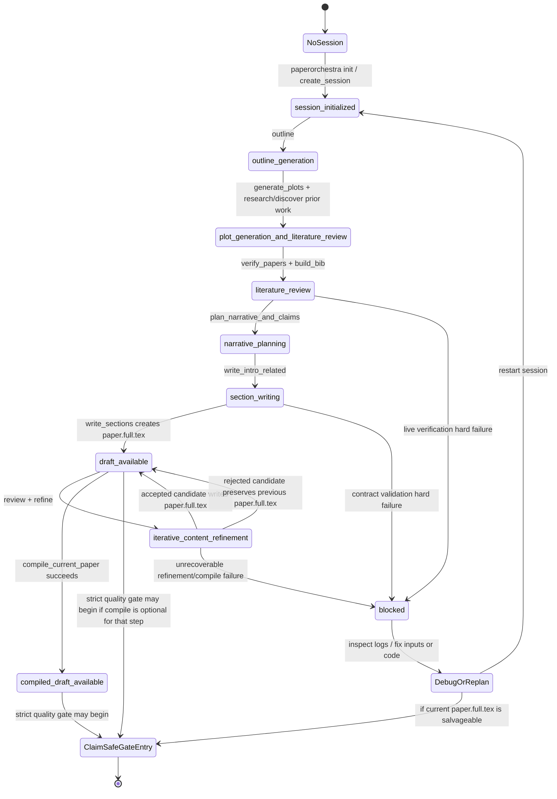
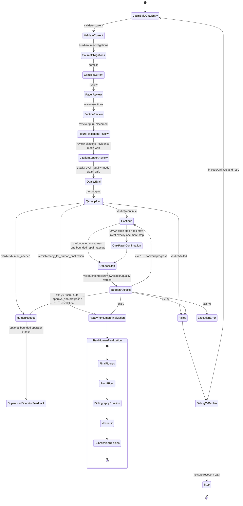
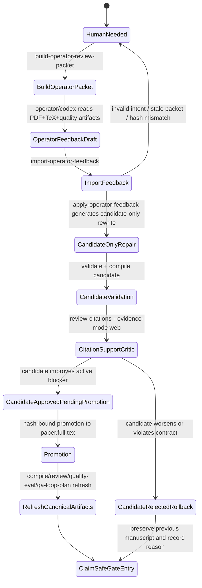
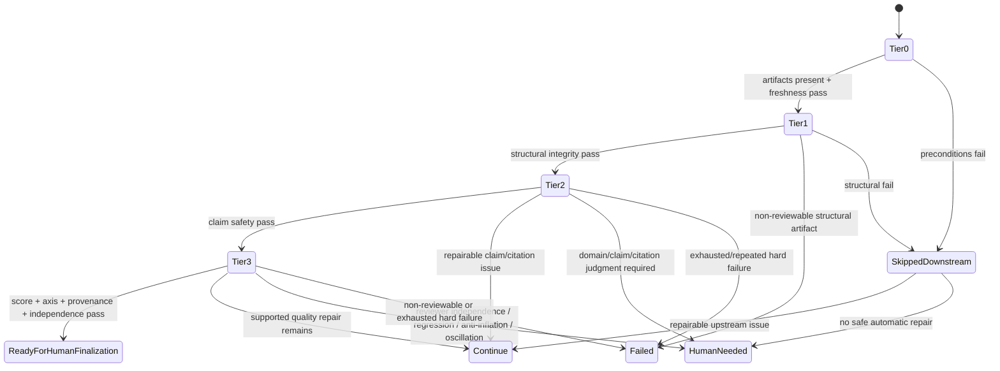

# PaperOrchestra quality-gate state machine

Status: **normative development contract** for the claim-safe PaperOrchestra lifecycle.

Grounding contract: this document is grounded only in tracked repository artifacts.
Current grounding sources are `paperorchestra/`, `scripts/live-smoke-claim-safe.sh`, `scripts/pre-live-check.sh`, `scripts/controlled-quality-gate-smoke.py`, and `tests/`.
Ignored `review/` artifacts are historical audit outputs only and must not be cited here as current grounding.

This document exists to prevent a recurring failure mode: treating a paper-shaped draft, a compile-success PDF, a high section score, or a completed generation command as evidence that the paper is review-ready. PaperOrchestra may accelerate drafting, critique, citation support, and supervised repair, but the best automated terminal state remains **`ready_for_human_finalization`**, not “success” or “submission-ready”.

## Canonical principle

PaperOrchestra has **three coupled state machines**. Do not collapse them into one enum.

1. **Session/manuscript lifecycle** — persisted session phase and generation artifacts. It answers: “Where is the manuscript in the paper-generation lifecycle?”
2. **Claim-safe QA/Ralph lifecycle** — `quality-eval`, `qa-loop-plan`, `qa-loop-step`, semantic exit codes, and OMX/Ralph continuation. It answers: “May automation repair this manuscript, must it stop, or is it ready for human finalization?”
3. **Supervised operator-feedback lifecycle** — `human_needed` review packets, bounded operator feedback, candidate-only repair, approval/promotion/rollback, and refreshed quality gates. It answers: “When the loop asks for a human, how can a bounded operator response be incorporated without pretending it is independent human review?”

The coupling point is still `paper.full.tex`: generation writes it, QA evaluates it, operator feedback repairs it, and Ralph decides whether to continue. A clean `paper.full.tex` or PDF is not claim-safe readiness.

## State machine A — session / manuscript lifecycle



### Session lifecycle contracts

- Session inputs are snapshotted under `.paper-orchestra/runs/<session>/inputs/`; quality checks must resolve against session state, not ambient working-directory files.
- `SessionState.current_phase` remains partly free-form. Do not treat it as a closed, exhaustive enum unless code enforces that contract.
- `compile_current_paper` proves LaTeX/PDF availability only. It does **not** prove claim safety, citation support, scholarly quality, or review readiness.
- `paperorchestra run` or a staged generation path can produce a draft. It is never a substitute for the strict claim-safe gate.

## State machine B — strict claim-safe QA / Ralph lifecycle



### Semantic exit-code contract

| `qa-loop-step` exit | Verdict meaning | Owner of next move |
| --- | --- | --- |
| `0` | `ready_for_human_finalization` | Human/operator, because Tier 4 is still human-owned |
| `10` | `continue` | OMX/Ralph may run exactly one more bounded step |
| `20` | `human_needed` | Human/operator or supervised operator-feedback branch |
| `30` | `failed` | Debug/replan |
| `40` | `execution_error` | Debug/replan |

There is no `success` state.

## State machine C — supervised operator-feedback lifecycle

This lifecycle was added because PaperOrchestra intentionally stops at `human_needed`, but live smoke often needs the test operator to stand in for a bounded author/operator response. This response is **not** independent peer review and must remain auditable.



### Operator-feedback contracts

- Operator feedback must declare one explicit intent:
  - `generate_new_operator_candidate`
  - `approve_existing_candidate`
  - `reject_candidate_with_reason`
- Feedback must be bound to the current `packet_sha256` and `manuscript_sha256`.
- Candidate metadata must include candidate/source hashes, source execution path/hash, and creation time.
- A no-op rewrite must not be promoted as an improvement.
- Promotion and post-promotion QA are separate states. `promotion_status=promoted` is not the same thing as “claim-safe passed”.
- If a better candidate only makes dependent artifacts stale, the correct next action is to refresh stale artifacts, not silently restore the worse manuscript.
- Bounded operator feedback can unblock smoke testing, but it must not be counted as independent human review.

## Tier short-circuit inside `quality-eval`



### Tier 0 — Preconditions and freshness

Purpose: prove the evaluator is looking at the current manuscript and current supporting artifacts.

Typical checks:

- `paper.full.tex` and manuscript hash exist;
- validation, compile, section review, figure-placement review, citation-support review, source obligations, and planning artifacts are present and fresh;
- canonical session artifact paths and evidence-root copies agree when both are used.

Contract:

- If Tier 0 fails, Tier 1-3 are skipped or non-load-bearing.
- Evidence-root files are review copies; canonical session artifacts remain the source of truth unless state explicitly points to the evidence path.

### Tier 1 — Structural integrity

Purpose: reject non-reviewable artifacts before semantic or scholarly scoring.

Checks include:

- clean compile/PDF when required;
- citation-key integrity;
- prompt/meta/process leakage in TeX, generated plot text assets, and extractable PDF text;
- provenance completeness.

Contract:

- Prompt/meta/process leakage is `failed`, not `human_needed`.
- A human should not be asked to review leaked prompt/control garbage as if it were a paper.
- The 2026-04-27 smoke proved the existing meta-leak scanner is too narrow: it reported zero findings while Q1 critic found reviewer-visible process prose such as `supplied technical core`, `experimental log`, `reviewable figure files`, and `available source materials`.

### Tier 2 — Claim safety

Purpose: prevent unsupported claims, citation misuse, source-material omissions, and unsafe benchmark/security claims from reaching reviewer-score readiness.

Checks include:

- unsupported comparative claims;
- numeric grounding;
- web citation-support critic;
- source-obligation satisfaction;
- high-risk uncited claim sweep;
- narrative/claim/citation-plan satisfaction.

Contract:

- S2 metadata verification helps resolve candidates and metadata; it does **not** prove a cited sentence is supported.
- Cited-sentence support requires `review-citations --evidence-mode web` or equivalent web-capable claim-support review.
- Paper-specific construction, proof, and benchmark claims should normally cite the paper's own sections/tables or remain uncited author claims; external citations should support external facts, standards, and prior work.
- Mixed sentences must be split when they combine external background with paper-specific claims.

### Tier 3 — Scholarly quality

Purpose: use reviewer/section critics only after structural and claim-safety gates are quiet.

Checks include:

- review schema and review provenance;
- all required score axes and justifications;
- section-quality critic;
- reviewer independence;
- anti-inflation, regression, and oscillation detection.

Contract:

- Writer/refiner receives structured issues, not numeric reviewer scores.
- A single same-provider review can route repairs, but cannot by itself establish `ready_for_human_finalization`.
- Section scores are advisory unless Tier 0-2 pass. A high section score must not mask process leakage or citation-scope violations.

### Tier 4 — Human finalization

Always human-owned:

- final figures;
- proof rigor;
- bibliography curation;
- venue fit;
- submission decision.

Contract:

- Tier 4 is never automated.
- `ready_for_human_finalization` means “automation may stop and a human can finalize,” not “the paper is done.”

## Canonical artifact and evidence contract

The live-smoke evidence root should be complete enough for an external reviewer to audit the run, but it is not automatically canonical.

Required evidence classes:

- command lines, stdout, stderr, and exit codes for every step;
- input material snapshot and hashes;
- prompt/response traces for model-mediated stages;
- final TeX, PDF, PDF text, references, quality-eval, qa-loop-plan, citation/section/figure reviews;
- operator feedback packets, imported feedback, incorporation result, and candidate/promotion metadata;
- Q1/top-tier critic report for smoke interpretation.

Canonical consistency requirement:

- `quality-eval`, `qa-loop-plan`, final exported review files, and Q1 critic should refer to the same current manuscript hash and citation-support artifact hash.
- If an evidence copy is stale while session state is fresh, the evidence manifest must say so.
- If a final summary counter is derived from loop control variables, it must match command evidence. The 2026-04-27 smoke reports `operator_feedback_cycles: 4` in `readable/verdict.json`, while command evidence shows three applied cycles (`operator_apply_cycle_1..3`). That counter is a harness bug and should be fixed before relying on it as audit evidence.

## Ralph / OMX continuation contract

PaperOrchestra does not own an infinite loop internally. It emits bounded commands, artifacts, and semantic exit codes. OMX/Ralph owns persistence.

Ralph loop rule:

1. read the current `qa-loop-plan` / `qa-loop-brief`;
2. if verdict is `continue`, execute exactly one `qa-loop-step`;
3. if verdict is `human_needed`, either stop or enter the supervised operator-feedback lifecycle;
4. inspect `qa-loop-execution.iter-N.json` and refreshed `quality-eval`;
5. continue only if exit code is `10` and forward progress is recorded;
6. stop on `ready_for_human_finalization`, `failed`, `execution_error`, budget exhaustion, no-progress override, or oscillation.

Contract:

- Do not silently switch to mock provider in claim-safe smoke.
- Do not continue through terminal verdicts unless a human/operator explicitly creates a new bounded branch of work.
- Hook/tmux injection may continue `continue` states; it must not override terminal states.
- `human_needed` is not a failure of the system. Premature `ready_for_human_finalization` is worse than a correct `human_needed`.

## QA-loop budget contract

Budget-consuming event:

```text
qa_loop_step / supervised candidate repair attempt
```

Non-budget diagnostic/planning events:

- `quality-eval`
- `qa-loop-plan`
- `qa-loop-brief`
- `ralph-start --dry-run`
- build/review packet inspection

Contract:

- Diagnostics can be repeated without spending repair attempts.
- Only bounded repair attempts consume loop budget.
- If a candidate repair is semi-auto and uncommitted, canonical artifacts must be restored or regenerated before returning.
- Oscillation detection should stop or route to `human_needed` even if raw budget remains.

## Invalid transitions

These transitions are forbidden unless future code explicitly changes this contract and adds adversarial tests:

| Invalid transition | Why forbidden |
| --- | --- |
| `DraftGeneration --> ReadyForHumanFinalization` | generation is not the quality gate |
| `CompileSuccess --> ReadyForHumanFinalization` | PDF existence is not claim safety |
| `Tier0 fail --> Tier3 score load-bearing` | downstream scores are misleading when artifacts are stale/missing |
| `metadata verified --> cited claim supported` | S2 metadata verification is not cited-sentence support |
| `single reviewer --> ready` | reviewer self-consistency/collusion risk |
| `forged/stale review --> reviewer independence` | only authenticated current review artifacts count |
| `prompt/meta/process leakage --> human_needed` | non-reviewable artifact must fail |
| `qa-loop-plan --> budget consumed` | planning is non-budget; repair attempts consume budget |
| `human_needed --> automatic continuation` | needs explicit human/operator branch |
| `operator feedback --> independent peer review` | supervised operator feedback is bounded author/operator input only |
| `candidate improved one blocker --> discard without refresh reason` | stale dependent artifacts must be refreshed before rollback is trusted |
| `ready_for_human_finalization --> submission` | Tier 4 remains human-owned |

## Code surface map

| Contract area | Primary code surface |
| --- | --- |
| Full generation pipeline | `paperorchestra/pipeline.py` |
| Narrative/claim/citation planning | `paperorchestra/narrative.py`, `paperorchestra/pipeline.py::plan_narrative_and_claims` |
| Manuscript validation and leakage gates | `paperorchestra/validator.py`, `paperorchestra/quality_loop_leakage.py`, `paperorchestra/quality_loop_policy.py` |
| Tier evaluation and verdict rules | `paperorchestra/quality_loop.py`, `paperorchestra/quality_loop_plan_logic.py` |
| QA-loop step and Ralph bridge | `paperorchestra/ralph_bridge.py`, `paperorchestra/ralph_bridge_handoff.py`, `paperorchestra/ralph_bridge_state.py` |
| Operator feedback lifecycle | `paperorchestra/operator_feedback.py` |
| Citation/section/figure critics | `paperorchestra/critics.py`, `paperorchestra/quality_loop_citation_support.py`, `paperorchestra/quality_loop_reviews.py` |
| S2 metadata wrapper | `paperorchestra/s2_api.py`, `paperorchestra/literature.py` |
| Source obligations | `paperorchestra/source_obligations.py` |
| CLI surfaces | `paperorchestra/cli.py` |
| Runtime/OMX bridge | `paperorchestra/omx_bridge.py` |
| Operator docs | `README.md`, `ENVIRONMENT.md` |

## 2026-04-27 fresh full live smoke lessons

This section preserves lessons from a local 2026-04-27 operator smoke run. Its ignored evidence bundle is not part of the tracked repository and is not current grounding for this contract.

Observed good behavior:

- `write_sections`, compile, review, citation review, quality eval, QA-loop plan, and Q1 critic all executed.
- The loop reached `human_needed` instead of pretending the draft was ready.
- Operator feedback cycles were exercised and auditable artifacts were captured.
- Final `quality-eval` kept Tier 3 skipped because Tier 2 claim safety still failed.

Observed contract gaps:

- The leak detector missed reviewer-visible process prose; Q1 critic caught it.
- Citation-support summaries differed across final artifacts, indicating canonical/evidence-copy consistency is not yet airtight.
- The system generated/improved candidates but sometimes restored the older manuscript after dependent checks became stale or regressed; promotion/refresh/rollback semantics need tighter evidence.
- Section scoring was too generous relative to process residue and citation-scope problems.
- The smoke harness final counter overreported operator cycles.

Current interpretation:

- Final `human_needed` is the correct state for this run.
- The output is a technically substantive internal draft, not yet a serious external-review draft.
- The next development focus should be leakage linting, citation-support canonicalization, candidate promotion semantics, and section-score calibration before another expensive full smoke.

## Maintenance checklist for future changes

Before changing this state machine or weakening a gate:

1. Add an adversarial regression test for the transition being changed.
2. Run targeted tests for the touched state machine surface.
3. Run `python3 -m unittest discover -s tests -q` before committing broad behavior changes.
4. Run a controlled smoke before spending a full live smoke.
5. Preserve the no-`success` verdict alphabet unless a new human-owned finalization type replaces it.
6. Keep persistent looping in OMX/Ralph, not inside PaperOrchestra.
7. Update this document only when code, tests, and evidence support the new transition.
